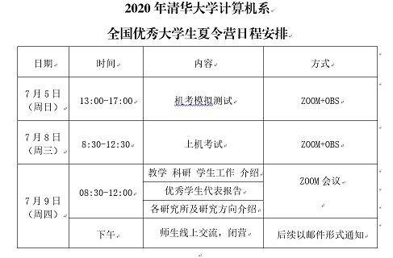
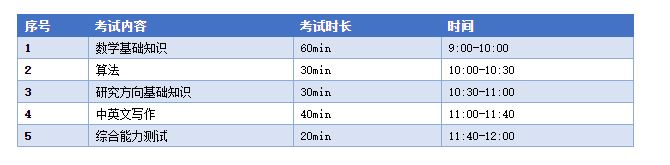

[toc]
# 保研经历

## 1.前言

大家好，这里是大工学长的保研经历分享，希望对大家能有一丝帮助，也欢迎各位同学上传自己的经历。

今年因为疫情时间影响，大部分夏令营都推迟到了7，8月份，比较早的有清华叉院，南大lamda等。

夏令营因为时间过得比较久了，许多记不大清了，时间线也比较乱，就不按真实先后顺序来了，大家凑合着看吧  : -)

## 2.北大软微预推免

北大软微面试经历：
9.24面试，我9.23乘动车先到住北京了一晚，住宿选了个好点的200左右，来回车票520左右，想想也是不容易，就软微特殊一点搞个线下面试，这估计也刷了一拨人吧。

* 面试流程：
  我那组是当天上午9点开始面试，先是大家一起进去手撕代码，15分钟，题目大概是:
* 输入5个数，求和
* 给出一组数，有正数、有负数和0，求4个数的最大乘积
* 求[ N,M] 区间里 素数的个数

我当时就选的第三题，因为一看就知道是素数筛法，记得还行，就选了这题。

手撕代码之后就是一个一个轮流面试，时间有长有短，好像北大的学生就6-10分钟左右，其余同学可能10分钟+，因为我是上午倒数第二个，也没人帮看下时间，不过我估计大概也10多分钟。

* 说一下面试问题吧：
  关于英语问题：
  好像没有自我介绍，是让我选择简历上的一个项目，然后用英语介绍一下。这个当时我还是比较尴尬的，恰好这个项目没用英语准备过，所以就工地英语飙起来，卡卡顿顿。可能是因为我讲的不好，老师又再三追问，就是用英语问我，你这个项目的目标是什么，你在其中担任什么角色，解决了什么问题。（所以说好好准备自己的项目真的很重要，不要学我啊= =）
  虽然英语回答不咋样，提问的女老师还是很和善的，一脸微笑，感谢这位老师让我放松了不少。

* 然后是一些专业问题：
  1.软件项目管理中的控制以及配置是什么？在哪里实行？
  当时软件项目管理这门课上的是网课，我没怎么好好听，基本上忘得差不多了，所以就瞎答了，当时答的什么时间，成本，质量三方面的约束关系，以及控制质量管理在整个软件开发过程中实行。总之答得不好，老师也笑着说你这门课没学好啊。（我只能是强颜欢笑）
  2.看你数据结构学的不错，考你一下链表的问题，怎么判断是否为环，怎么找到环的入口？
  我算法还是差，只模糊的记得双指针的思想，具体解答大家自行百度吧。
  3.根据我的项目，问了我一个多线程的问题，同步死锁相关的问题，具体记不太清了
  4.对了，当时先是让你挑个数字，然后老师会问你个问题，具体我想不起来。。只记得我选了个100，图个吉利，嘿嘿
  
  5.让我没想到的是，还问了我选修的中国古典哲学概论学了啥，可能是看我分数考得比较高吧。。。又问我知不知道王阳明，他的观点是什么，幸好我还有点印象答了知行合一，然后又问我知在前还是行在前，让我有点懵

---

追记：最后还是去了北大软微了，可能还是有点遗憾了，感觉自己如果这个假期再努力努力，或许可以更进一步，但是软微也不差吧，虽然学费贵了点，但也是北大呀，也算是圆了自己清华北大梦吧。。。未来还要继续努力呀！！

---

## 3.南京大学计算机学院预推免

南大预推免经历：
暑期夏令营自不量力报的是AI学院，想冲一把LAMDA实验室，当然是毫无悬念被刷了，所以这次就掂量着自己的水平报计算机了。不过当时主要还是因为手头上没有一个明确的offer所以就想着多报多尝试，也没有抱着很大期待，后来出结果了候补在54位，估计也是凉凉。

* 面试时间9.25 下午

先是让你选个PPT答题，是4道选择，数据结构相关的，有给代码选择输出结果的，有离散数学相关的，每道题1-2分钟作答，最后5秒报个答案。最后我确定的也就2道，想想自己还是菜啊。

* 然后就是专业面试了，就三个老师，我也记不清有没有自我介绍，不过问题主要还是根据你的项目来问：

  1. 介绍一下你有那些项目

  2. 用英语介绍一下你其中一个项目
  3. 我在项目中提到了多线程，让我解释一下CPU的核与多线程的关系
  4. 向外行人解释一下同步锁的概念
  5. 什么是矩阵的特征值和特征向量

说起来南大还让学生自己记录下当天面试的问题，这波有点离谱，不过也得亏记录下来了，不然我可能还真想不起来问了啥问题

----

追记：好像是推免的上午，南大打了个电话，说是还有专硕名额问我去不去，看样子南大真的是被鸽穿了。。。

---

## 4.浙江大学计算机学院预推免

浙大的夏令营好像只收直博生，但我当时也没有强烈的读博意愿所以没有报，不过听说浙大的直博夏令营得做一个月左右，还是挺耗费心思和时间的。说回预推免，说起来还真是有点一波三折。一开始我报的是计算机学院的预推免，但是由于自己当时没有一个确定的offer，加上浙大的硕士外校名额不是很多，所以还是有点担心害怕的。后来在一些保研群里看到都说计算机学院竞争很激烈，建议报名软件学院（浙软），因为害怕没有保底，所以我后来又改成浙软了。但是后面浙大计算机面试流程出来了，今年只面试没有机试，让我后悔不已，不过好在一波操作之下，我还是有机会去面试计算机学院的预推免，后来我也把浙软的给退了。现在回头想想，自己可能是被博弈了，不过主要还是自己的立场不够坚定，目标不够明确，对自己不够有信心导致的吧，所以说，大家一定要想好自己的目标，不强求也不将就，摆正自己的定位。

* 面试时间是在9.26下午

  浙大用的是钉钉来面试（果然独具一格），先是拉你进一个会议室，做相关检查，然后再把老师拉进来，开始面试。首先，你要共享PPT，介绍自己，大概8~10分钟左右，期间包括1~2分钟的英文介绍，英文介绍的内容自己决定。我大概是分了成绩展示，科创竞赛，项目经历三个方面来讲，我认为主要是讲好项目吧，2~3个左右，大致讲明三个点，你这个项目要解决什么问题，你在这个项目承担什么任务/做了什么贡献，这个项目有什么创新点，差不过这样就可以了，我是因为没多少项目经历，所以大概7分钟不到介绍完了。

* 面试问题:

  1.先是根据我说的一个项目涉及了大屏展示的相关技术，所以让我讲一下大屏技术的三个实现难点，我只回答出来了数据的实时更新同步啥的，老师说不太对，这是网络网速相关的，后来问我怎么实现的，我说用的是帆软的设计工具，老师说用的是商业工具啊，就没再追问了。

  2.看我的专业是软件工程，问了我相关知识，比如什么是敏捷开发，和传统的开发方式相比有什么好处，适合什么类型项目的开发；黑盒测试和白盒测试

  3.别的专业问题记不太清了，之后好像唠嗑了一下，问我为啥你这个专业这么多人什么的。。大工软院，牛！

今天浙大预推免没有机试，感觉还是让我占了不少便宜的，不然我可能真的机试拉胯直接无了（所以说，真的要好好准备！！！），虽然感觉面试还可以，但是一想到可能就十来个学硕名额，自己的希望还是不大，所以还是随缘吧。

---

追记：浙大填报志愿的时候没有考虑专硕，所以因为志愿不满足所以没有直接录取，原本的话可能有专硕直接录了，所以如果不在意专硕学硕的填那个志愿表的时候就都填上吧。后来出成绩候补二十几名，推免补录的时候也给我打电话了，说明机会还是挺大的，不过因为已经决定去北大软微了所以就拒了。

---

## 5.北大

北大叉院和北大信科的夏令营都无情被刷，菜，就不提了  o(╥﹏╥)o

---

## 6.清华

清华贵系侥幸入营，夏令营的流程比较简单，一天机考，一天介绍交流，没有面试，直接上图吧。

机考具体考了啥我也记不太清了，只记得自己第一题（签到？）得了80分，第二题好像是个模拟题，模拟实际内存分页管理，对文件进行增删改查，做了一个多小时也没通过一个测试点。。。第三题没仔细看也记不起内容了。总之对我来说还是有点难吧，不过还是得怪自己没有好好准备机试，在家老废柴了，大家别学我。

第二天面试介绍也没怎么仔细听吧，反正也是各种高大上，因为我感觉机试成绩实在不咋滴感觉希望不大。下午也去听了一些老师交流，但是因为我之前也没联系过老师，没报多大希望，所以最后草草收场，归根结底还是自己没有好好准备，以及对自己不够自信吧，下意识感觉自己上不了，所以在这里我希望大家可以都对自己有点信心，莽就完事了，老师也积极联系，厚点脸皮。

后来贵系也发来了邮件通知，告知我机试成绩不太理想，但可以再次报考预推免。比较贴心的是最后贵系还发了个结业证明~

---

## 7.南大Lamda && AI学院

南大Lamda实验室今年也是开放的比较早，比计算机科学和AI的夏令营通知要早许多，最后我还是看保研群里有人说才知道已经开始报名了，巧的是我知道的那个晚上恰好是截止报名的那个晚上。所以在最后1个小时里补了相关材料交了上去，其实也没抱多大希望，只是听说Lamda实验室很强所以觉得还是可以试试的，看看有无机会。

面试流程的话，应该是分为三面吧，虽然我在第二面就已经被刷了orz

* 一面就是实验室的学长学姐问你一些问题，主要还是根据你的简历项目来问吧，因为有记录，我被问了以下三个问题

  1. 图的表示方式，邻接表和邻接矩阵的区别
  2. 项目相关，对神经网络的认识
  3. 对机器学习的认识？ 如果你遇到科研挫折了，论文屡投不中，你怎么处理？
  
* 二面就是老师来面了，问了些数学相关的问题和机器学习相关的：
  
  1. 什么是半正定矩阵
  2. 什么是大数定律
  3. 为什么想要接触机器学习
  4. 如果看待人工智能
  5. 有工程能力吗
  6. 读研动机

然后就没有然后了。。。。

---

## 8.北航

北航夏令营有机试和面试，机试可以用C语言的CCF-CSP来抵，如果你足够高的话可以考虑，但具体多少划算我也不清楚，因为我考得是JAVA，雨我无瓜。不过这次的机试难度还可以吧，至少我还有思路来写，测试样例能过，我记得一道是模拟题，一道是和树相关的，是BFS还是DFS来着我忘了。

然后是面试，我面试的时候大概有四五个老师，提问的就两三个吧，先是问了一道政治题，好像是问我如何看待疫情中的中国，然后考察了一下英语能力，问专业知识，具体问题因为时间久了，记不大清了，只记得一个问了计算机网络相关的知识点，OSPF和RIP的区别，一个老师看我的专业时软件工程问了我相关内容，比如什么叫结构化程序，软件开发的流程是怎么样的，如何来管理项目。

面试下来，自我感觉还是不太好的，特别是软件工程那里，都没怎么复习，被问得死死的，当时感觉要凉了，不过后来出来的时候还是录了，不过是在倒数那一页上了。。。但进了总比没进好，说起来，北航算是我第一个拿了优秀营员的学校了，直至后来的预推免，我也只手握北航这一个优营，想想， 北航真的是给了我安心和底气，真的是意义非凡，虽然最后还是很可惜没有去，但还是很感谢北航和联系的老师，非常的和善亲切。

---

## 9.上交

上海的两所高校报了上交和复旦，复旦大数据被刷了。。上交的面试惨不忍睹，提问的三个问题几乎没完整回答上来一个，当时面试直接心态崩了，只能说自己实力不够吧。

* 一个 CPU 访问硬盘数据经过哪些介质

* 一个计算机二进制 有什么优势
* 一个乱序处理的工作原理，什么 reorder buffer的作用

---

## 10.计算所

计算所的夏令营，我报的VIPL实验室的一个老师，当时还不了解VIPL的难度，就是选的老师恰好是这个实验室，后来才了解到竞争很激烈，我报的那个老师8、9个同学竞争一个专硕名额。VIPL的流程也比较多，有笔试，机试，面试。笔试流程如下：

机试的话就四道题，一个小时，主要是给一段代码，让你完善一个方法或是修改一下使其能够正常运行，都比较简单。

面试的话，主要是问了一些数学相关的知识点，矩阵，大数定律，贝叶斯公式等，还问了一个算法的思路，如何快速判断一个数是否为2次幂，还有机器学习相关的，具体记不大清了。面试感觉一般，没有表现特别好，后来面试当晚出结果了，没有录上，但是老师推荐我去面试了别的老师，一个好像是另一个实验室的，一个是中科院的老师。后来中科院那个老师问我去不去他那，当时我觉得要是答应了就相当于上岸了，不能反悔，所以就没去，因为时间还挺早，还有自动化所的和以后预推免，感觉机会还有。不过现在想想，其实也可以先答应下了，先拿个offer，大不了最后当个鸽子。。。不过还是不太好，自己也过意不去，所以也就直接拒绝了。

## 11.自动化所

自动化所也独有特色，先是举办了2天的讲座，介绍自动化所的各个实验室和研究方向，然后再开始面试。结果面试很糟糕，因为之前看网上的面经说自动化所对数学比较看重，所以数学知识点看得多，但结果不尽人意，感觉问得挺深的，不是表面的一些概念性知识点，记得问了我正交矩阵是什么，并证明一下为什么正交矩阵特征值绝对值为1，还问了我如何证明傅里叶变换。。。几乎是完全溃败，我记得印象比较深的是最后问了我，你说一下为什么自动化所要选你，直接一秒破防，是我实力不够，告辞。。。

## 12.总结

终于收工了，写的断断续续，零零散散，最后还是硬撑着写完了，可能有挺多废话，还希望大家多多谅解吧。写这么一篇保研经历分享，既是应学长之邀，也是对自己这段时间经历的一个总结回顾吧。最后总结三点吧，我认为保研过程中最重要的三个部分，绩点+专业知识/代码能力+科研/竞赛/项目，得其一保上心仪学校概率20%，得其二50%，得其三80%（仅一家之言），往这三方面准备八九不离十。然后我也会把之前复习准备的一些面试问题放在相应文件夹下，供大家参考。

最后的最后，祝诸君前程似锦，大家都有美好的未来~

